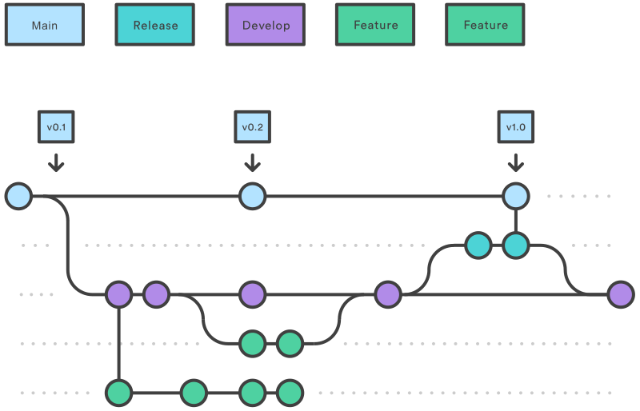

# Política de Branches
## Visão Geral
Nossa política de branches segue o modelo GitFlow, que organiza o fluxo de trabalho de desenvolvimento em diferentes tipos de branches. Esse modelo ajuda a manter a estrutura organizada, facilitando o desenvolvimento, a manutenção e a implementação de novas funcionalidades. Abaixo está uma descrição detalhada de cada tipo de branch usado no nosso repositório.



## Tipos de Branches
**1. Branch main**
- **Propósito**: Contém a versão de produção do código. Deve estar sempre em um estado estável e pronto para ser lançado.
- **Regras**: Apenas código totalmente testado e aprovado deve ser mesclado nesta branch.
As releases são feitas a partir desta branch.
**2. Branch develop**
- **Propósito**: Contém o código mais recente com todas as novas funcionalidades aprovadas para o próximo lançamento. É a principal branch de integração.
- **Regras**: Todas as novas funcionalidades e correções de bugs devem ser mescladas nesta branch.
Este branch é usado para teste de integração antes da release final.
**3. Branches de Feature**
- **Nomeação**: feature/[nome-da-feature]
- **Propósito**: Usados para desenvolver novas funcionalidades ou melhorias. Esses branches se ramificam de develop e, uma vez completos, são mesclados de volta na develop.
- **Regras**: Devem ser baseados na branch develop.
Devem ser mesclados de volta ao develop após a conclusão e revisão.
**4. Branches de Release**
- **Nomeação**: release/[versão]
- **Propósito**: Preparar uma nova versão de produção. Permite pequenas correções de bugs e ajustes finais. Uma vez pronto, é mesclado na main e na develop.
- **Regras**: Devem ser baseados na branch develop.
Devem ser mesclados na main e na develop após a conclusão.
**5. Branches de Hotfix**
- **Nomeação**: hotfix/[nome-do-hotfix]
- **Propósito**: Usados para aplicar correções urgentes diretamente no código de produção. Esses branches se ramificam da main e, uma vez completos, são mesclados de volta na main e na develop.
- **Regras**: Devem ser baseados na branch main.
Devem ser mesclados na main e na develop após a conclusão.


## Fluxo de Trabalho
### Desenvolvimento de Funcionalidades
- Crie um branch de feature a partir do develop:
```
git checkout develop
git checkout -b feature/[nome-da-feature]
```
- Desenvolva a funcionalidade e faça commits regularmente.
- Quando a funcionalidade estiver completa, abra o pull request para revisão.
### Preparação para Release
- Crie um branch de release a partir do develop:
```
git checkout develop
git checkout -b release/[versão]
```
- Realize testes e pequenos ajustes necessários.
- Faça o merge no main e no develop mediante aprovação de pull request.
### Correção de Bugs em Produção
- Crie um branch de hotfix a partir do main:
```
git checkout main
git checkout -b hotfix/[nome-do-hotfix]
```
- Faça as correções necessárias e teste.
- Faça o merge no main e no develop mediante aprovação de pull request.

### Conclusão
Seguir essa política de branches baseada no GitFlow ajudará a manter o código organizado e facilitará a integração e o lançamento de novas funcionalidades. Isso garante que a versão de produção esteja sempre estável e que o desenvolvimento de novas funcionalidades e correções de bugs ocorra de forma estruturada e previsível.

## Referências

- [Atlassian - Saiba tudo sobre o Gitflow Workflow](https://www.atlassian.com/br/git/tutorials/comparing-workflows/gitflow-workflow)